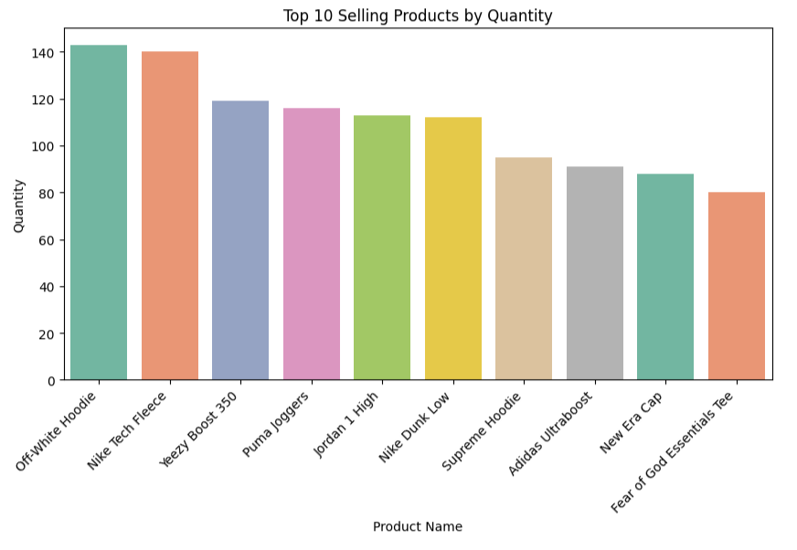
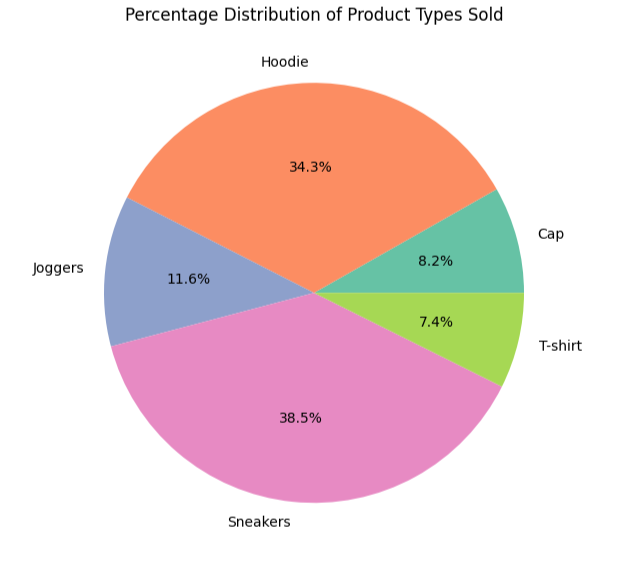
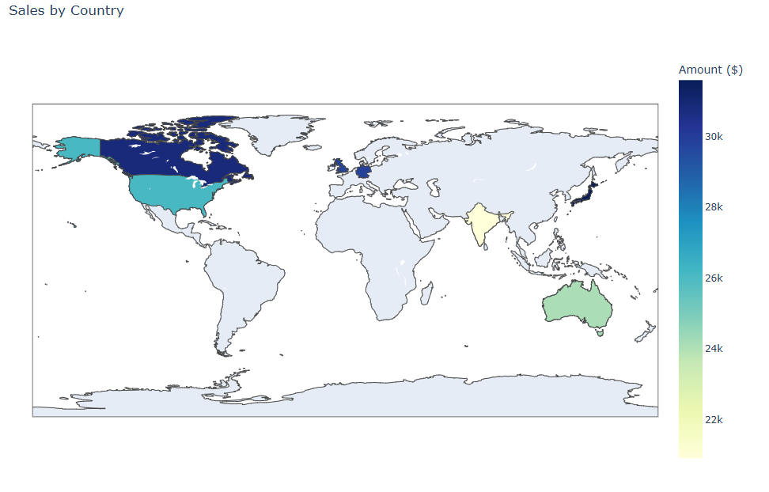
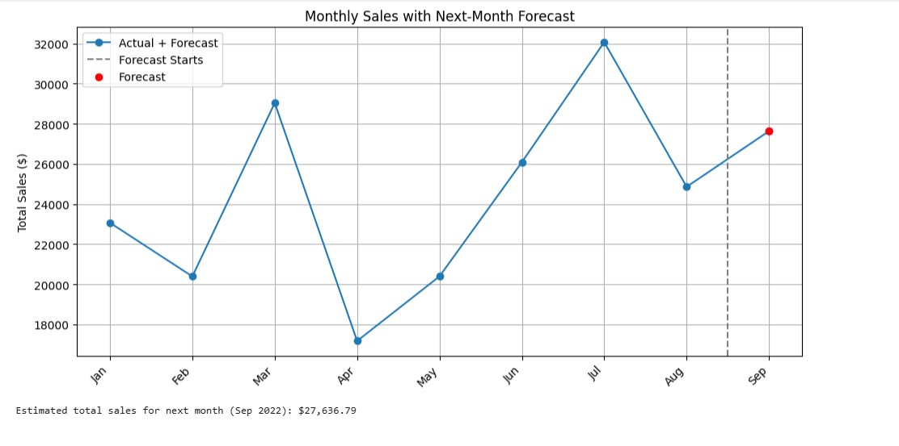

# Sales Analytics: Global Sneaker & Streetwear Market

## Project Overview  
Exploratory analysis and a simple next-month sales forecast on a simulated e-commerce dataset covering January–August 2022. The project highlights top products, product type distribution, payment preferences, country performance, and a one-step linear forecast.

---

## Demo





---

## Key questions answered
- Which products and product types sold the most?  
- How did monthly sales change over time?  
- Which countries contributed most to revenue?  
- Which payment methods were most commonly used?  
- What is a simple forecast for next month’s total sales?

---

## Files
- `sneaker-streetwear-sales-analysis.ipynb` — full Jupyter notebook with code, visuals, and commentary.  
- `sneakers_streetwear_sales_data.csv` — the dataset used for analysis (Apache 2.0 license).  
- `requirements.txt` — Python packages used.  
- `figures/` — exported PNGs used in the README.

---

## Data
The dataset is licensed under **Apache 2.0** and sourced from Kaggle (simulated sneaker & streetwear sales, Jan–Aug 2022).
- Includes 500 clean, non-null, and unique transaction records. It covers sales from several countries and over 30 product names.
- Full dataset is included in the repo for reproducibility.  
- Attribution: Kaggle dataset `https://www.kaggle.com/datasets/atharvasoundankar/sneakers-and-streetwear-sales-2022`.  

---

## How to run
1. Clone the repo:
   ```bash
   git clone https://github.com/PKTrance/sneaker-streetwear-sales-analysis.git
   cd sneaker-streetwear-sales-analysis
2. Install dependencies:
   ```bash
   pip install -r requirements.txt
3. Open the notebook:
   ```bash
   jupyter notebook sneaker-streetwear-sales-analysis.ipynb

## Notes

The notebook is organized into: Introduction, Data Overview, EDA (product/category/country/payment), Key Insights, and Forecasting.

The forecast uses a simple linear regression as a demonstration of predictive thinking given limited history. 

## Contact

Patrick Tran — `https://www.linkedin.com/in/patricktran22/` — patricktran@g.ucla.edu
